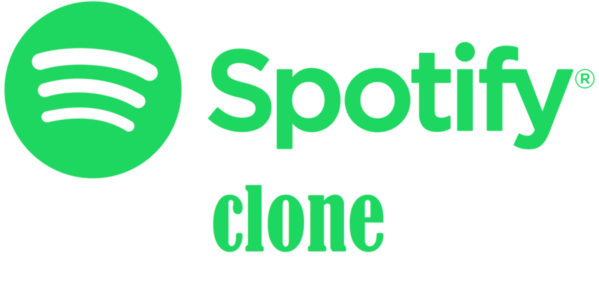

<h1 align="center">
    
</h1>

## :rocket: Built with

This project was developed with the following technologies:

-  [React Native](https://facebook.github.io/react-native/)
-  [Expo](https://expo.io/)
-  [Styled Components](https://www.styled-components.com/)
-  [Axios](https://github.com/axios/axios)
-  [Json Server](https://github.com/typicode/json-server)
-  [React Navigation](https://reactnavigation.org/)
-  [react Native Vector Icons](https://github.com/oblador/react-native-vector-icons)
-  [ESLint](https://eslint.org/)
-  [Prettier](https://prettier.io/)
-  [VS Code](https://code.visualstudio.com/)

## :information_source: How to run the application locally
### Requirements
To run the app, you will need [Git](https://git-scm.com), [Node.js](https://nodejs.org/) v12.13.1 or higher and [Yarn](https://yarnpkg.com/)

The Application was develop using Expo. It is a free and open source toolchain built around React Native to facilitate the process of running and testing applications. [Click here](https://expo.io/learn) to get start with Expo.

Now clone the repository and install the dependencies.
```bash
# to clone the repository
git clone https://github.com/StefanoSaffran/spotify-clone.git

# go into the project folder
cd spotify-clone

#install the dependencies
yarn

```

In order to run the application on your device, you need to change the ip config in 2 places.

1. [package.json](https://github.com/StefanoSaffran/spotify-clone/blob/master/package.json)
```json
  "server": "json-server --host 192.168.0.185 -p3333 db.json -w"
```
2. [api.js](https://github.com/StefanoSaffran/spotify-clone/blob/master/src/services/api.js)
```javascript
  baseURL: 'http://192.168.0.185:3333',
```
replace 192.168.0.185 with your machine's ip.

Now with everything on place, run the json-server that has the application data and then run the app.
```bash
# to run the json-server
yarn server

# to run the app
yarn start
```
Expo will open a page in your browser, scan the QRcode on the page and wait for the app to load.

> The Application was developed and tested on Iphone 6s

### Contributing

#### Want to contribute?
Great, the project is open source and any contribution is welcome.

#### How ?
1. Fork the [project](https://github.com/StefanoSaffran/spotify-clone)
2. Create a branch for your contribution. Example: git checkout -b myWonderfulFeature
3. Add your changes: git add.
4. Commit your changes: git commit -m 'Adding my wonderful feature'
5. Push the branch created earlier: git push origin myWonderfulFeature
6. Open a pull request here: https://github.com/StefanoSaffran/spotify-clone/pulls

---

### TODO

- [ ] Animated Player
- [ ] Profile Page

---

## :page_facing_up: License

This project is under the MIT license. See the [LICENSE](https://github.com/StefanoSaffran/spotify-clone/blob/master/LICENSE) for more information


## :mailbox_with_mail: Get in touch!

[LinkedIn](https://www.linkedin.com/in/stefanosaffran/) | [Website](https://stefanosaffran.com)

Made with :coffee: and ♥ by Stefano Saffran.


